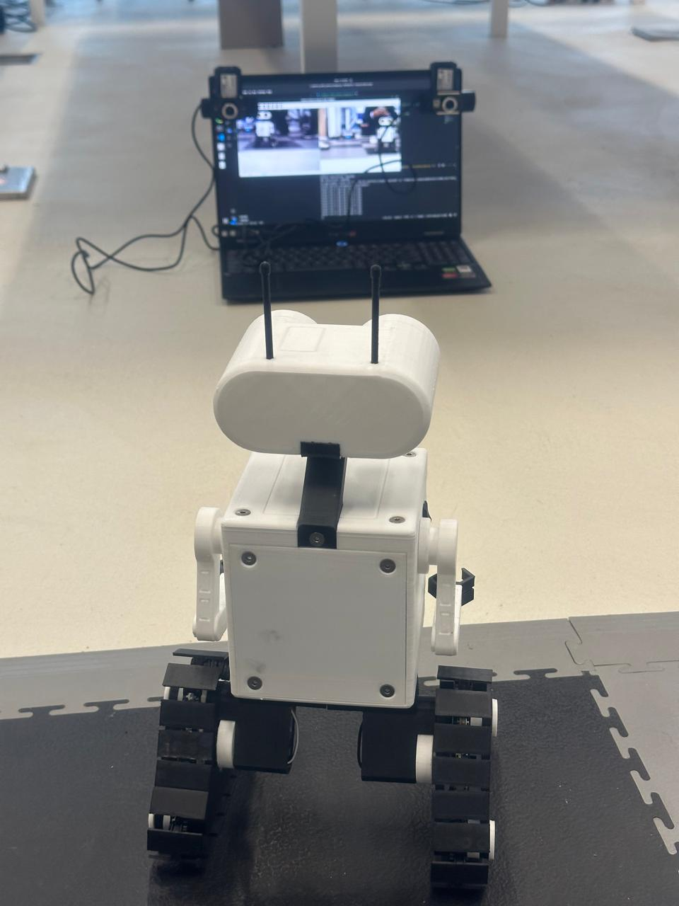
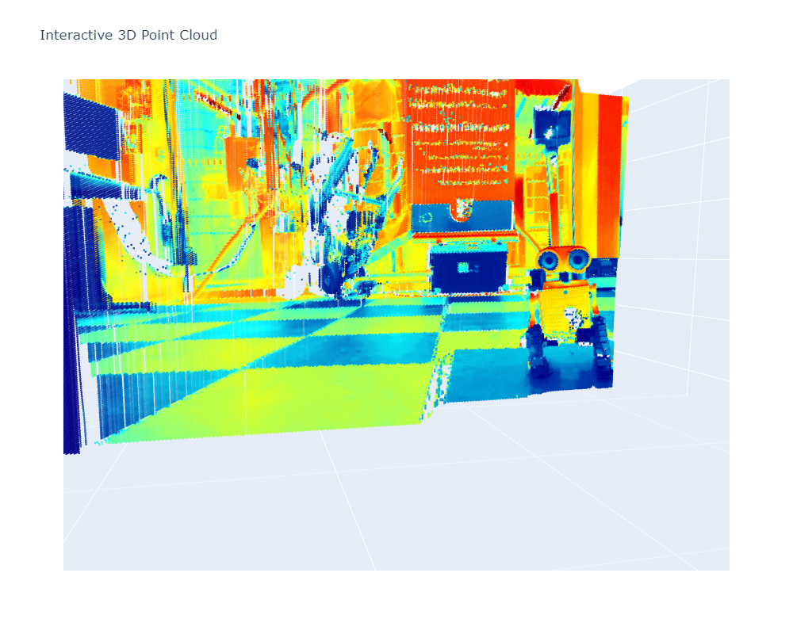
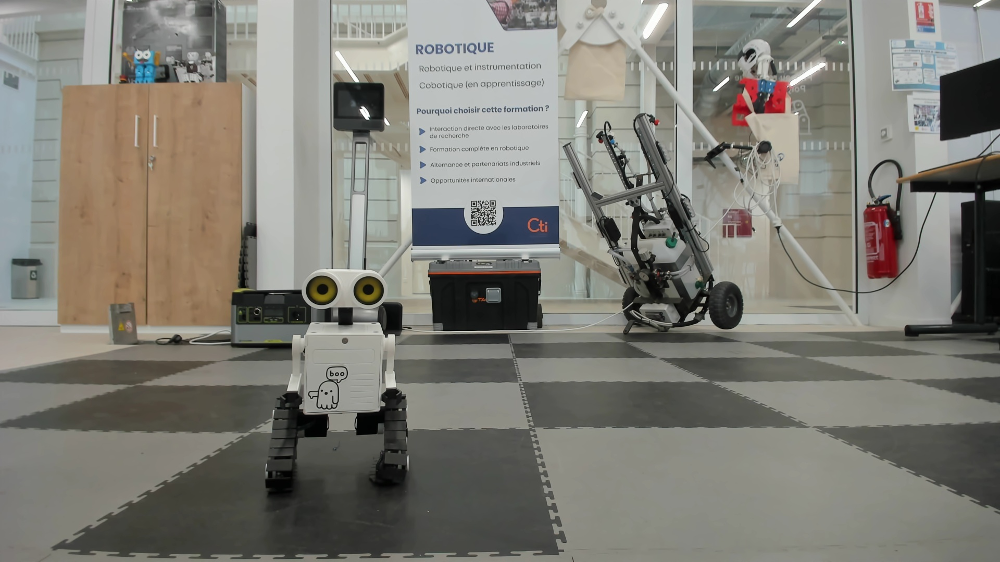

# Stereo Vision: Dense 3D Reconstruction Using Dual Webcams

This project implements a full stereo vision pipeline using two parallel webcams to generate a dense 3D reconstruction of a scene. It uses OpenCV-based techniques for calibration, rectification, disparity map generation, and triangulation to reconstruct a 3D point cloud.

---

## 📸 Setup Overview

- **Camera Configuration**: Two identical webcams placed in parallel at the same height and nearly the same angle, separated by a fixed **baseline of 32 cm**.
- **Image Resolution**: 1920x1080 (maximum supported by the webcams).
- **Sample Setup Photo**:  
  


## 🧪 Project Pipeline

### 1. Camera Capture

- Using `scripts/1_capture_multi_camera_images.py`, both webcams are initialized.
- Streams from both cameras are shown side by side.
- User can save synchronized stereo pairs to `calibration_photos/left/` and `right/` by pressing the `s` key.

### 2. Calibration

Performed in the main notebook `4-Stereo_Vision_Dense_3D_Reconstruction_FULL.ipynb`:
- **Checkerboard Detection**: Uses (7, 9) inner corners.
- **Preprocessing**: Images enhanced via sharpening, CLAHE, and denoising to improve corner detection.
- **Intrinsic Calibration**: Each camera calibrated individually.
- **Stereo Calibration**: Determines the spatial relation (R, T) between cameras. Also outputs:
  - Essential (E) and Fundamental (F) matrices
  - Rectification transforms (R1, R2), projection matrices (P1, P2), disparity-to-depth matrix (Q)
- All results are saved in `output/stereo_calibration_parameters.npz`.

### 3. Rectification

- Stereo image pair from `extra/` is rectified using saved calibration parameters.
- Horizontal epipolar alignment verified using overlaid lines.
- Vertical disparity checked: consistent ~5 pixels (ideally 0).

### 4. Disparity Map (Dense)

- **Method Used**: StereoBM + WLS Filtering (Edge-preserving).
- **Notes**: StereoBM is simpler and less computationally expensive, though not as accurate as SGBM.
- The disparity map is not perfect but good enough for depth estimation.

### 5. (Optional) Feature Matching (Sparse)

- **Features**: SIFT descriptors used.
- **Matches**: ~1100 good matches found.
- This approach is useful for sparse reconstruction, but for dense 3D we moved to disparity-based triangulation.

### 6. Triangulation & Dense Point Cloud

- Disparity map used with the Q matrix to generate a **dense 3D point cloud**.
- Visualized using matplotlib.
- Final result:  
  

---

## 🖼 Sample Test Image Used

This is the test image pair rectified and used for disparity:



---

## 📦 Dependencies

Make sure to install `opencv-contrib-python`:

```bash
pip install opencv-contrib-python
