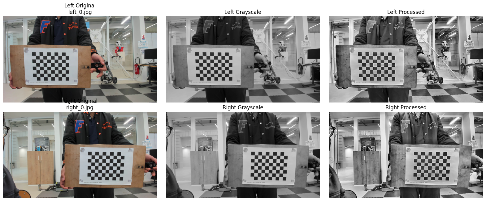
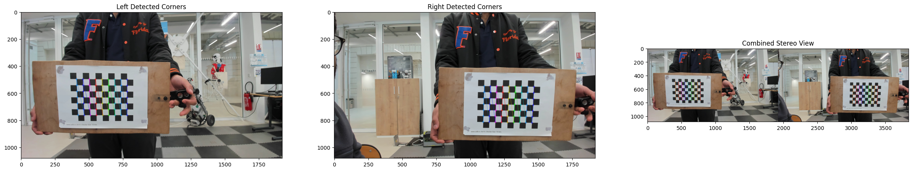
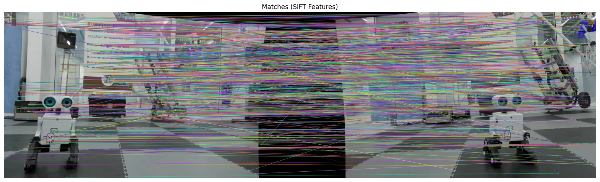

# Stereo Vision: Dense 3D Reconstruction Using Dual Webcams

This project implements a full stereo vision pipeline using two parallel webcams to generate a **dense 3D reconstruction** of a scene using OpenCV. It covers image capture, camera calibration, stereo geometry estimation, image rectification, disparity map generation, feature matching (optional), and triangulation to reconstruct a dense 3D point cloud.

---

## 🔧 Ideal Stereo Setup & Theory

- **Stereo vision** enables depth perception by using two cameras placed side-by-side.
- **Key Conditions**:
  - Both cameras should be **parallel**, placed at the **same height**, and have **identical resolution**.
  - Use a fixed **baseline** (32 cm used here).
  - Ensure good lighting and rigid camera placement.
  - Cameras used here capture at **1920×1080 resolution**.
- Baseline photo:  
  

---

## 🖼 Test Image Used

This stereo image pair is used in rectification, disparity, and triangulation:


---

## 📁 Project Structure

```
calibration_photos/
├── left/       # Left checkerboard images
└── right/      # Right checkerboard images

scripts/
└── 1_capture_multi_camera_images.py

output/
├── stereo_calibration_parameters.npz
├── calibration_preprocessing.png
├── calibration_corner_detections_in_both_cameras.png
└── feature_matching_sift.png

extra/
└── left_48.jpg / right_48.jpg   # Test stereo pair

4-Stereo_Vision_Dense_3D_Reconstruction_FULL.ipynb  # Main pipeline
Stereo_Camera_Project_Report_Draft.pdf              # 📄 Project Report
```

---

## 📦 Dependencies

Install all requirements with:

```bash
pip install opencv-contrib-python matplotlib numpy
```

---

## 🧪 Stereo Vision Pipeline (Step-by-Step)

Each step below corresponds to a section in the notebook `4-Stereo_Vision_Dense_3D_Reconstruction_FULL.ipynb`.

---

### 1️⃣ Image Capture

- Captures synchronized stereo images from two webcams

- Captured frames are saved to:
  - `calibration_photos/left/`
  - `calibration_photos/right/`

Script used: `scripts/1_capture_multi_camera_images.py`

---

### 2️⃣ Calibration

- **Checkerboard Grid**: 7×9 inner corners
- **Image Enhancement** before corner detection:
  

- Uses:
  ```python
  cv2.findChessboardCorners() + cv2.cornerSubPix()
  ```

- Corner detection visualization:
  

- **Intrinsic Calibration** for each camera:
  ```python
  cv2.calibrateCamera(...)
  ```

- Results:
  - Left Reprojection Error: `0.90 px`
  - Right Reprojection Error: `0.92 px`

- **Stereo Calibration** for camera relationship:
  ```python
  cv2.stereoCalibrate(..., flags=cv2.CALIB_FIX_INTRINSIC)
  ```

- Outputs: `R`, `T`, `E`, `F`, `R1`, `R2`, `P1`, `P2`, `Q`, remap maps.

🗂️ Saved in: `outputs/stereo_calibration_parameters.npz`

---

### 3️⃣ Stereo Geometry Estimation

- **Purpose**: Compute relative pose (R, T) from essential matrix `E`
- Uses:
  ```python
  cv2.findEssentialMat()
  cv2.recoverPose()
  ```

- Outputs:
  - **R_est**: Rotation matrix
  - **T_est**: Translation vector
  - **E**: Essential matrix (from correspondences)
  - **F**: Fundamental matrix (pixel-based)

These values are useful for sparse reconstruction and understanding stereo camera alignment.

---

### 4️⃣ Rectification

- Aligns both images horizontally (epipolar alignment).
- Uses:
  ```python
  cv2.stereoRectify()
  cv2.initUndistortRectifyMap()
  ```

- Remaps images to common plane:
  ```python
  cv2.remap()
  ```

- Optional vertical disparity check showed ~5px difference (should ideally be 0).
- Sample rectified result visualized with epipolar lines.

---

### 5️⃣ Disparity Map (Dense Depth)

- Method Used: **StereoBM + WLS Filter**
  ```python
  cv2.StereoBM_create()
  cv2.ximgproc.createDisparityWLSFilter()
  ```

- Filters disparity with smoothness & edge-aware enhancement.

- Notes:
  - Works better on **textured areas**.
  - Performance depends on **baseline**, **lighting**, and **camera alignment**.

---

### 6️⃣ Feature Matching (Optional - Sparse)

- Descriptor Used: **SIFT**
  ```python
  sift = cv2.SIFT_create()
  ```

- Matcher: Brute Force + Ratio Test
  ```python
  bf = cv2.BFMatcher()
  bf.knnMatch(...)
  ```

- Result:
  - Detected: `4236` keypoints in left, `4487` in right
  - Good matches: `1008` after Lowe’s ratio test

- Visualization:
  

🔎 Sparse matching is useful for pose estimation and essential matrix computation.

---

### 7️⃣ Triangulation & Dense 3D Point Cloud

- Converts disparity into 3D coordinates:
  ```python
  points_3D = cv2.reprojectImageTo3D(disparity_map, Q)
  ```

- Filters valid points (where disparity > 0)
- Colors are extracted from left rectified image

- Visualized with:
  ```python
  matplotlib.pyplot.scatter(..., c=colors)
  ```

- Final 3D result:
  

---

## 🔄 Full Pipeline Summary

| Step                      | Key Function / Method                   |
|---------------------------|------------------------------------------|
| Image Capture             | `cv2.VideoCapture()`                    |
| Intrinsic Calibration     | `cv2.calibrateCamera()`                 |
| Stereo Calibration        | `cv2.stereoCalibrate()`                |
| Essential Matrix          | `cv2.findEssentialMat()`                |
| Recover Pose              | `cv2.recoverPose()`                     |
| Stereo Rectification      | `cv2.stereoRectify()`, `cv2.remap()`    |
| Disparity (Dense)         | `cv2.StereoBM_create()` + WLS           |
| Feature Matching (Sparse) | `cv2.SIFT_create()`, `BFMatcher()`      |
| 3D Point Cloud            | `cv2.reprojectImageTo3D()`              |

---

## 📄 Project Report

You can find the PDF write-up of this implementation here:
📄 `Stereo_Camera_Project_Report_Draft.pdf`

---